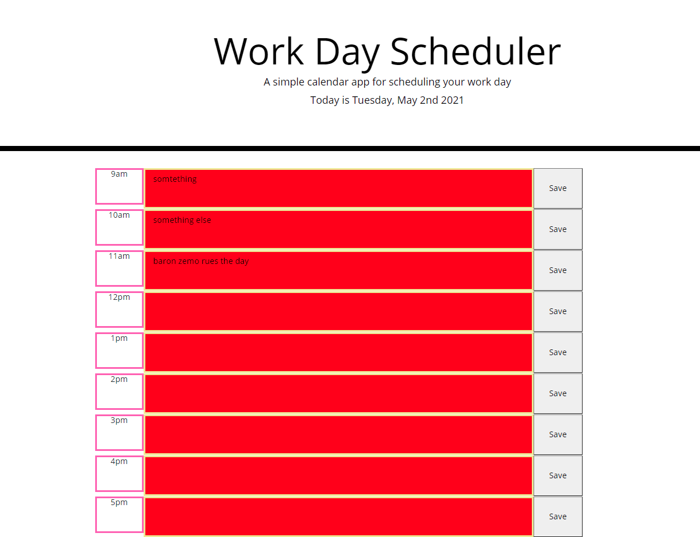

# day-planner
Hi! My name is Josh. Welcome to my day planner. Its a website that allows you to create a TODO list for your work day. It also helps you track how much time you have by color coding the text areas! I hope you enjoy it. The image below was taken later in the day which is why all the text areas are red. 

[Here is a link to my deployed website, check it out!](https://sand-ito.github.io/day-planner/)

To operate the website its pretty simple. Go to the time that you want to give yourself a reminder. Fill out the text area with your desired input and press save. The text area should be saved to that input until you decide to change it.
The color changes automatically based on the time throughout the day.

Thank you for taking your time to look at my code, and interface with my website. 

Have a nice day

-Joshua Livak